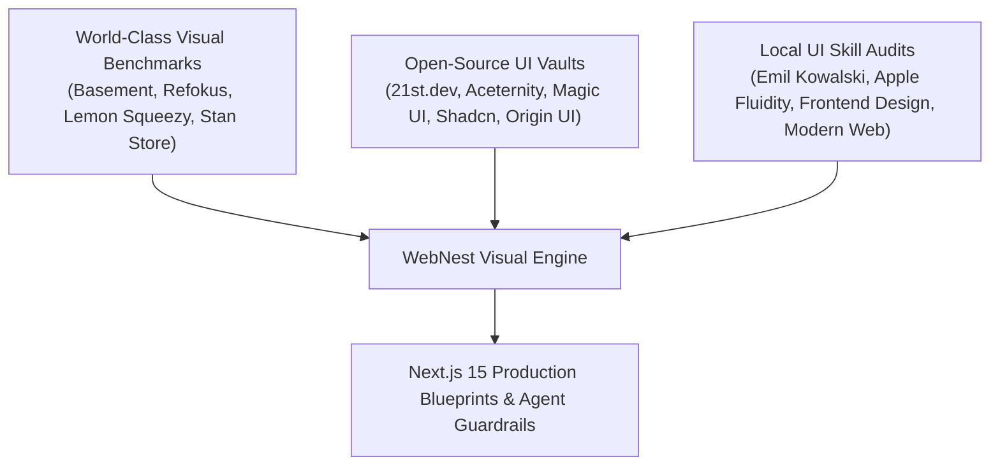

# WebNest: Visual Design System, Agency Benchmarks & UI Component Vault
**STORM Multi-Agent Research Synthesis & Project Agent Implementation Guide**  
Governing Project: `C:\Users\DELL\Documents\webnest`  
Design Standard: Emil Kowalski Craft Sensibility + Apple Fluid Interfaces + Modern Web Standards  
Target Stack: Next.js 15 (App Router), React 19, Tailwind CSS, Lucide React, Radix UI Primitives  

---

## 1. Executive Summary & STORM Research Architecture

To ensure WebNest looks like an elite, award-winning $10k+ design studio rather than a cheap Fiverr gig or generic template, we conducted a multi-perspective STORM investigation decomposing three pillars:



1. **Agency Showcase Analysis**: Dissecting visual layout archetypes, hero architectures, portfolio proof layouts, and pricing presentations from the world's most acclaimed digital agencies and creator platforms.
2. **Open-Source Component Registries & Vaults**: Curating copy-paste libraries, community component hubs like `21st.dev`, and modern interaction kits for Next.js 15 and Tailwind CSS.
3. **Internal UI Skills Codification**: Distilling the core tenets of our installed design skills (`emil-design-eng`, `frontend-design`, `web-design-guidelines`, `apple-design`, `modern-web-guidance`, and `animation-vocabulary`) into actionable rules that eliminate AI design tells and guarantee fluid interactions.

---

## 2. World-Class Agency & Storefront Benchmarks

### 1. Basement Studio (`https://basement.studio`)
* **Design Archetype**: Dark-mode neo-brutalism, engineering-first craftsmanship, custom typography (Geist by Vercel/Basement).
* **Key Visual Mechanics**:
  * High-contrast neutral canvas: Deep neutral background (`#0a0a0a` to `#000000`) paired with hairline borders (`border-white/10` or `border-neutral-800`).
  * Micro-interactions that convey weight: Buttons and interactive cards have tactile spring responses on pointer-down.
  * Live status pill: Header badges indicating current availability or release versions.
* **Takeaway for WebNest**: Use subtle 1px borders, deep dark backgrounds, and precise typography hierarchy to give WebNest an authoritative, professional feel.

### 2. Refokus (`https://refokus.com`)
* **Design Archetype**: Webflow Agency of the Year, immersive showcase websites, goal-oriented micro-interactions.
* **Key Visual Mechanics**:
  * The "Showcase Website" concept: Treating every web page as an interactive digital product rather than static brochureware.
  * Visual proof: Video previews, interactive card hover states, and performance metrics directly embedded into project cards.
* **Takeaway for WebNest**: Frame client stores (Elikar, Light Pen Hub) not as static images, but as high-performance e-commerce engines with metrics ("Loaded in 0.4s", "Instant Telegram/WhatsApp checkout").

### 3. Lemon Squeezy (`https://lemonsqueezy.com`)
* **Design Archetype**: Clean, approachable, minimalist digital storefront platform ("Easy-peasy").
* **Key Visual Mechanics**:
  * Neutral canvas with single vibrant accent: Soft grays and clean whites paired with a vivid lemon accent for key actions.
  * Zero-friction sales copy: Direct benefit-driven headlines that solve the "blank page" problem for sellers.
  * Modular product cards: Thumbnail images with clear price tags, instant buy links, and streamlined checkout modals.
* **Takeaway for WebNest**: Keep the purchasing friction near zero. The customer sees the offer, picks their add-ons, and immediately taps to WhatsApp.

### 4. Stan Store (`https://stan.store`)
* **Design Archetype**: Mobile-first creator storefront, 1-tap checkout, radical conversion focus.
* **Key Visual Mechanics**:
  * The "Rule of Few Products": Curating only 3 to 6 high-value offerings on the main view to prevent choice paralysis.
  * Mobile slide-over drawers: Tapping an item opens a bottom sheet rather than loading a new page, keeping context intact.
  * Objection handling inside cards: Direct answers to common vendor hesitations (delivery time, hosting fees) right next to the buy button.
* **Takeaway for WebNest**: Optimize primarily for mobile viewports (375px to 425px) since over 85% of Nigerian campus vendors and shoppers browse on mobile.

### 5. Gumroad (`https://gumroad.com`)
* **Design Archetype**: Flat, content-first layout, bold sans-serif typography (Mona Sans / ABC Favorit), utility over decorative fluff.
* **Key Visual Mechanics**:
  * Shift from excessive gradients to crisp flat surfaces with bold black strokes.
  * Generous whitespace and container discipline: Every section has clear padding and breathing room.
* **Takeaway for WebNest**: Avoid gaudy neon washes or over-saturated gradients. Use flat, disciplined cards with crisp emerald/slate accents.

### 6. Designjoy (`https://designjoy.co`)
* **Design Archetype**: Productized service pioneer, flat-fee clarity, zero-meeting async intake.
* **Key Visual Mechanics**:
  * Transparent pricing matrix: Everything included is clearly bulleted; exclusions are eliminated.
  * 48-Hour delivery guarantee badge: Prominently displayed across hero and pricing sections to eliminate delivery anxiety.
* **Takeaway for WebNest**: Highlight the ₦10,000 base ticket and the 48-Hour delivery turnaround as non-negotiable promises.

---

## 3. Free UI Component Vaults & Open-Source Repositories

### A. 21st.dev (`https://21st.dev`)
* **Identity**: "The npm for Design Engineers." A community registry of copy-paste React + Tailwind + Framer Motion components.
* **Key Features**:
  * **Magic Prompts**: Provides the exact prompt to recreate or modify components inside AI coding environments.
  * **Registry Installation**: Run `npx shadcn@latest add <component-url>` to directly pull components into your project.
  * **21st MCP Server**: Can be connected directly to AI coding assistants to search and insert verified UI components.
* **Top Component Categories for WebNest**: Floating animated badges, glowing border cards, bento grids, and dynamic pricing toggles.

### B. Aceternity UI (`https://ui.aceternity.com`)
* **Core Value**: Modern, visually impactful copy-paste components with physics and shader effects.
* **Essential Components for WebNest**:
  * `CardSpotlight`: Mouse-following radial glow on package cards.
  * `TextGenerateEffect` / `FlipWords`: Dynamic headline animations for the hero section.
  * `BentoGrid`: Modular container system for store add-ons.
* **Install Command**:
  ```bash
  npm install framer-motion clsx tailwind-merge lucide-react
  ```

### C. Magic UI (`https://magicui.design`)
* **Core Value**: 150+ free, open-source animated components built to blend seamlessly with shadcn/ui.
* **Essential Components for WebNest**:
  * `ShimmerButton`: Radiant animated border button for high-converting checkout CTAs.
  * `BentoGrid` & `BentoCard`: Dense, Apple-style feature grids with integrated mock UI elements.
  * `Marquee`: Infinite scrolling ticker for student vendor logos, customer reviews, and trust badges.
  * `BorderBeam`: Laser-tracing animated border around the Pro Vendor package card.
* **Install CLI**:
  ```bash
  npx shadcn@latest add "https://magicui.design/r/shimmer-button"
  npx shadcn@latest add "https://magicui.design/r/bento-grid"
  npx shadcn@latest add "https://magicui.design/r/marquee"
  ```

### D. Shadcn UI (`https://ui.shadcn.com`) & Origin UI (`https://originui.com`)
* **Shadcn UI**: The foundation of modern React interfaces. Zero runtime lock-in; you own the code in `components/ui/`.
  * Primitives needed: `Sheet` (slide-over cart), `Dialog` (case study modals), `Checkbox` (pricing calculator), `Accordion` (FAQ), `Badge`.
  * Initialization:
    ```bash
    npx shadcn@latest init
    npx shadcn@latest add sheet dialog checkbox badge card accordion separator
    ```
* **Origin UI**: Extensive extension for shadcn/ui featuring 40+ variations of advanced inputs, currency formatters, and pricing toggles. Perfect for building the add-on calculator with custom check states.

### E. Curated Design Galleries for Inspiration
| Gallery | URL | Primary Focus | Best Used For |
| :--- | :--- | :--- | :--- |
| **Godly** | `https://godly.website` | Video previews of micro-interactions and smooth scroll | Hero sections, card hover states, motion ideas |
| **Land-book** | `https://land-book.com` | High-converting landing pages filtered by category | Offer presentation, pricing cards, social proof |
| **Curated.design** | `https://www.curated.design` | Aesthetic web directory with bold editorial typography | Avoiding generic corporate SaaS looks |
| **Mobbin** | `https://mobbin.com` | Mobile UX flows (iOS, Android, Web) | Mobile slide-over carts and order review sheets |
| **Hover.dev** | `https://www.hover.dev` | Tailwind + Framer micro-interactions | Magnetic buttons, tab switches, animated cards |
| **UIverse** | `https://uiverse.io` | Open-source community CSS/Tailwind snippets | Custom toggles, checkmarks, and button effects |
| **Tremor Raw** | `https://raw.tremor.so` | Data dashboard components | Mock Order Tracking Admin table in the Bento grid |

---

## 4. Internal UI Skills Synthesis & Non-Negotiable Directives

By auditing the 6 internal design skills installed in the environment, we extract strict rules that the Project Agent must follow:

### 1. Emil Kowalski Craft Sensibility (`emil-design-eng`)
* **Never use `transition: all 300ms`**: Specify exact properties (e.g. `transition: transform 200ms ease-out, opacity 150ms ease-out`).
* **Physics of appearance**: Elements must not pop out of nowhere (`scale(0)` is forbidden). Use `transform: scale(0.95); opacity: 0` transitioning to `scale(1); opacity: 1`.
* **Button press states**: Every button and clickable card MUST have an active press state:
  ```css
  .button:active {
    transform: scale(0.97);
    transition: transform 100ms ease-out;
  }
  ```
* **Easing curves**: Use `ease-out` for dropdowns, drawers, and feedback to provide instant responsiveness. `ease-in` feels sluggish.
* **Transform origins**: Popovers and tooltips scale from their trigger button (`transform-origin: var(--transform-origin)`), whereas modals scale from center.

### 2. Eliminating AI Design Tells (`frontend-design`)
The Project Agent must strictly avoid the standard markers of AI-generated landing pages:
* **NO warm cream backgrounds with serif display and terracotta accents** (`#F4F1EA` + serif + `#D97757`).
* **NO broadsheet newspaper layouts with hairline rules and zero border-radius**.
* **NO generic SaaS-card kits**: Avoid slicing the entire page into identical rounded cards with the same soft gray shadow (`rgba(0,0,0,0.1)`) and gradient washes.
* **NO template chrome**:
  * Avoid tracked-out ALL-CAPS eyebrows above every heading.
  * Avoid meta strings joined with middle dots (`A · B · C`).
  * Strictly NO em-dashes (—) or en-dashes (–).
  * Avoid monospace fonts on standard body labels.
  * Avoid trailing `→` on every single link or button.
* **Spend boldness in ONE place**: Let the interactive pricing calculator and the live proof-of-work showcase be the memorable heroes. Keep the surrounding typography and chrome disciplined.
* **Numbered markers (`01 / 02 / 03`) ONLY for real sequences**: Use numbers only in the "How It Works in 3 Steps" section, nowhere else.

### 3. Apple Fluid Interfaces (`apple-design`)
* **Respond on pointer-down**: Visual feedback must trigger immediately on press, not after touch release.
* **Kill tap latency**: Apply `touch-action: manipulation` across interactive controls to eliminate the mobile 300ms tap delay.
* **Translucent materials**: Use subtle backdrops with backdrop blur:
  ```css
  bg-neutral-950/80 backdrop-blur-md border border-neutral-800
  ```

### 4. Web Interface Guidelines (`web-design-guidelines`)
* **Touch target sizes**: Minimum 44x44px (ideally 48x48px) for all mobile tap targets, buttons, and stepper controls.
* **WCAG AA contrast**: Ensure all text has a minimum 4.5:1 contrast ratio against dark backgrounds.
* **Mobile input font size**: Form inputs and text fields must use at least `16px` (`text-base` or `text-sm md:text-base`) to prevent iOS Safari auto-zoom on focus.
* **Keyboard navigation**: All interactive buttons, cards, and checkboxes must have visible focus rings (`focus-visible:ring-2 focus-visible:ring-emerald-500 focus-visible:outline-none`).

### 5. Modern Web Guidance (`modern-web-guidance`)
* Use `:has()` pseudo-classes for styling cards when an internal checkbox is checked:
  ```css
  .addon-card:has(input:checked) {
    border-color: rgb(16 185 129 / 0.5);
    background-color: rgb(23 23 23 / 0.9);
  }
  ```
* Set `fetchpriority="high"` on the primary hero graphic to optimize Largest Contentful Paint (LCP).

---

## 5. Production Next.js 15 Blueprints for WebNest

All components below are authored for Next.js 15 App Router, React 19, Tailwind CSS, and Lucide React. They follow strict client-server boundaries.

### Blueprint 1: Animated Hero Status Pill (`src/components/HeroBadge.tsx`)
```tsx
"use client";

import React from "react";
import { Sparkles, ArrowRight } from "lucide-react";

interface HeroBadgeProps {
  text?: string;
  subtext?: string;
  href?: string;
}

export function HeroBadge({
  text = "Launch in 48 Hours",
  subtext = "Base Storefront ₦10,000",
  href = "#pricing",
}: HeroBadgeProps) {
  return (
    <a
      href={href}
      className="group relative inline-flex items-center gap-2.5 rounded-full border border-emerald-500/30 bg-emerald-950/40 px-4 py-1.5 text-xs font-medium text-emerald-300 backdrop-blur-md transition-all duration-200 hover:border-emerald-400/60 hover:bg-emerald-900/50 hover:shadow-[0_0_20px_rgba(16,185,129,0.25)] active:scale-[0.98]"
      style={{ touchAction: "manipulation" }}
    >
      {/* Pulsing Live Beacon */}
      <span className="relative flex h-2 w-2">
        <span className="absolute inline-flex h-full w-full animate-ping rounded-full bg-emerald-400 opacity-75" />
        <span className="relative inline-flex h-2 w-2 rounded-full bg-emerald-500" />
      </span>

      <span className="font-semibold tracking-wide text-white">{text}</span>
      <span className="h-3 w-px bg-emerald-500/30" />
      <span className="text-emerald-400/90">{subtext}</span>

      <ArrowRight className="h-3.5 w-3.5 text-emerald-400 transition-transform duration-200 group-hover:translate-x-0.5" />
    </a>
  );
}
```

---

### Blueprint 2: Dynamic Add-On Calculator (`src/components/PriceCalculator.tsx`)
```tsx
"use client";

import React, { useState, useMemo } from "react";
import { Check, Sparkles, MessageCircle } from "lucide-react";

interface AddonItem {
  id: string;
  name: string;
  price: number;
  description: string;
  tag?: string;
}

const BASE_PRICE = 10000;
const PRO_BUNDLE_PRICE = 35000;
const WHATSAPP_PHONE = "2349000000000"; // Replace with Endurance's business line

const ADDONS: AddonItem[] = [
  {
    id: "cart",
    name: "Multi-item Cart Drawer",
    price: 5000,
    description: "Slide-over drawer with item counters, instant order preview, and local persistence.",
    tag: "Essential",
  },
  {
    id: "admin",
    name: "Order Tracking Admin Dashboard",
    price: 10000,
    description: "Private live table to update order statuses: Pending, Confirmed, Delivered, or Cancelled.",
  },
  {
    id: "cms",
    name: "Self-Serve Inventory CMS",
    price: 15000,
    description: "Update catalog products, prices, and out-of-stock badges without touching code.",
    tag: "High Value",
  },
  {
    id: "domain",
    name: "Custom Domain Setup (.store / .com)",
    price: 7500,
    description: "Custom DNS mapping, SSL certificate configuration, and branded link routing.",
  },
  {
    id: "analytics",
    name: "Traffic & Click Analytics",
    price: 5000,
    description: "Track daily visitors, catalog click-throughs, and WhatsApp conversion rates.",
  },
];

export function PricingCalculator() {
  const [selectedAddons, setSelectedAddons] = useState<Set<string>>(new Set(["cart"]));
  const [isProBundle, setIsProBundle] = useState<boolean>(false);

  const toggleAddon = (id: string) => {
    setIsProBundle(false);
    setSelectedAddons((prev) => {
      const next = new Set(prev);
      if (next.has(id)) {
        next.delete(id);
      } else {
        next.add(id);
      }
      return next;
    });
  };

  const selectProBundle = () => {
    setIsProBundle(true);
    setSelectedAddons(new Set(["cart", "admin", "domain", "analytics"]));
  };

  const selectCustom = () => {
    setIsProBundle(false);
  };

  const calculatedTotal = useMemo(() => {
    if (isProBundle) {
      return PRO_BUNDLE_PRICE;
    }
    const addonSum = Array.from(selectedAddons).reduce((sum, id) => {
      const item = ADDONS.find((a) => a.id === id);
      return sum + (item ? item.price : 0);
    }, 0);
    return BASE_PRICE + addonSum;
  }, [isProBundle, selectedAddons]);

  const whatsappUrl = useMemo(() => {
    const selectedNames = Array.from(selectedAddons)
      .map((id) => ADDONS.find((a) => a.id === id)?.name)
      .filter(Boolean)
      .join(", ");

    const packageType = isProBundle
      ? "Pro Vendor Bundle (₦35,000 Special)"
      : "Custom WebNest Build";

    const message = [
      "Hello WebNest! I want to launch my online storefront.",
      "",
      `Package: ${packageType}`,
      `Selected Features: Base Storefront (₦10,000)${selectedNames ? ", " + selectedNames : ""}`,
      `Total Estimated Investment: ₦${calculatedTotal.toLocaleString()}`,
      "",
      "Can we discuss setting up my store within 48 hours?",
    ].join("\n");

    return `https://wa.me/${WHATSAPP_PHONE}?text=${encodeURIComponent(message)}`;
  }, [isProBundle, selectedAddons, calculatedTotal]);

  return (
    <section id="calculator" className="relative mx-auto w-full max-w-5xl rounded-3xl border border-neutral-800 bg-neutral-950 p-6 md:p-10 shadow-2xl">
      <div className="flex flex-col gap-6 md:flex-row md:items-end md:justify-between">
        <div>
          <span className="text-xs font-semibold uppercase tracking-wider text-emerald-400">
            Interactive Cost Estimator
          </span>
          <h2 className="mt-1 text-2xl font-bold tracking-tight text-white md:text-3xl">
            Build Your Custom Storefront Package
          </h2>
          <p className="mt-2 text-sm text-neutral-400">
            Every store starts with our ₦10,000 Base Ticket. Add only what you need.
          </p>
        </div>

        <div className="inline-flex rounded-xl border border-neutral-800 bg-neutral-900/80 p-1">
          <button
            type="button"
            onClick={selectCustom}
            className={`rounded-lg px-4 py-2 text-xs font-medium transition-all ${
              !isProBundle
                ? "bg-neutral-800 text-white shadow-sm"
                : "text-neutral-400 hover:text-white"
            }`}
          >
            Custom Add-ons
          </button>
          <button
            type="button"
            onClick={selectProBundle}
            className={`flex items-center gap-1.5 rounded-lg px-4 py-2 text-xs font-semibold transition-all ${
              isProBundle
                ? "bg-emerald-500 text-neutral-950 shadow-md shadow-emerald-500/20"
                : "text-emerald-400 hover:text-emerald-300"
            }`}
          >
            <Sparkles className="h-3.5 w-3.5" />
            Pro Bundle (₦35k)
          </button>
        </div>
      </div>

      <div className="mt-8 grid grid-cols-1 gap-8 lg:grid-cols-3">
        <div className="space-y-4 lg:col-span-2">
          {/* Base Inclusion Card */}
          <div className="flex items-start justify-between rounded-2xl border border-emerald-500/30 bg-emerald-950/20 p-4 transition-all">
            <div className="flex items-start gap-3">
              <div className="mt-0.5 flex h-5 w-5 shrink-0 items-center justify-center rounded-md bg-emerald-500 text-neutral-950">
                <Check className="h-3.5 w-3.5 stroke-[3]" />
              </div>
              <div>
                <div className="flex items-center gap-2">
                  <h4 className="text-sm font-semibold text-white">
                    Base WebNest Storefront Engine
                  </h4>
                  <span className="rounded-full bg-emerald-500/10 px-2 py-0.5 text-[10px] font-semibold text-emerald-400">
                    Included
                  </span>
                </div>
                <p className="mt-1 text-xs text-neutral-400">
                  Full product gallery, item preview modal, 1-click WhatsApp checkout button, and free lifetime static cloud hosting.
                </p>
              </div>
            </div>
            <div className="text-right">
              <span className="text-sm font-bold text-white">₦10,000</span>
              <span className="block text-[10px] text-neutral-500">Base</span>
            </div>
          </div>

          {/* Add-ons List */}
          <div className="space-y-3">
            {ADDONS.map((addon) => {
              const isSelected = selectedAddons.has(addon.id);
              return (
                <div
                  key={addon.id}
                  onClick={() => toggleAddon(addon.id)}
                  className={`group relative flex cursor-pointer items-start justify-between rounded-2xl border p-4 transition-all duration-150 active:scale-[0.99] ${
                    isSelected
                      ? "border-emerald-500/40 bg-neutral-900/90 shadow-sm"
                      : "border-neutral-800 bg-neutral-900/30 hover:border-neutral-700 hover:bg-neutral-900/60"
                  }`}
                  style={{ touchAction: "manipulation" }}
                >
                  <div className="flex items-start gap-3">
                    <div
                      className={`mt-0.5 flex h-5 w-5 shrink-0 items-center justify-center rounded-md border transition-all ${
                        isSelected
                          ? "border-emerald-500 bg-emerald-500 text-neutral-950"
                          : "border-neutral-700 bg-neutral-800 group-hover:border-neutral-600"
                      }`}
                    >
                      {isSelected && <Check className="h-3.5 w-3.5 stroke-[3]" />}
                    </div>
                    <div>
                      <div className="flex items-center gap-2">
                        <span className="text-sm font-medium text-white">
                          {addon.name}
                        </span>
                        {addon.tag && (
                          <span className="rounded-md border border-neutral-700 bg-neutral-800 px-1.5 py-0.5 text-[10px] font-medium text-neutral-300">
                            {addon.tag}
                          </span>
                        )}
                      </div>
                      <p className="mt-1 text-xs text-neutral-400">
                        {addon.description}
                      </p>
                    </div>
                  </div>
                  <div className="text-right pl-4">
                    <span className="text-sm font-semibold text-emerald-400">
                      +₦{addon.price.toLocaleString()}
                    </span>
                  </div>
                </div>
              );
            })}
          </div>
        </div>

        {/* Investment Summary Box */}
        <div className="flex flex-col justify-between rounded-2xl border border-neutral-800 bg-neutral-900/60 p-6 lg:col-span-1">
          <div>
            <span className="text-[11px] font-semibold uppercase tracking-wider text-neutral-400">
              Investment Summary
            </span>

            <div className="mt-3">
              <span className="text-4xl font-extrabold tracking-tight text-white">
                ₦{calculatedTotal.toLocaleString()}
              </span>
              <p className="mt-1 text-xs text-neutral-400">
                {isProBundle
                  ? "Pro Vendor Bundle applied (Save ₦7,500)"
                  : "One-time setup fee. Zero recurring hosting costs."}
              </p>
            </div>

            <div className="mt-6 space-y-2.5 border-t border-neutral-800 pt-4 text-xs">
              <div className="flex justify-between text-neutral-300">
                <span>Core Storefront:</span>
                <span className="text-neutral-400">₦10,000</span>
              </div>
              <div className="flex justify-between text-neutral-300">
                <span>Selected Add-ons:</span>
                <span className="text-neutral-400">
                  {selectedAddons.size} selected
                </span>
              </div>
              <div className="flex justify-between text-neutral-300">
                <span>Delivery Guarantee:</span>
                <span className="font-medium text-emerald-400">Within 48 Hours</span>
              </div>
              <div className="flex justify-between text-neutral-300">
                <span>Hosting:</span>
                <span className="font-medium text-emerald-400">Free Lifetime</span>
              </div>
            </div>
          </div>

          <div className="mt-8 space-y-3">
            <a
              href={whatsappUrl}
              target="_blank"
              rel="noopener noreferrer"
              className="flex w-full items-center justify-center gap-2 rounded-xl bg-emerald-500 px-5 py-3.5 text-sm font-semibold text-neutral-950 transition-all duration-150 hover:bg-emerald-400 hover:shadow-[0_0_25px_rgba(16,185,129,0.3)] active:scale-[0.97]"
              style={{ touchAction: "manipulation" }}
            >
              <MessageCircle className="h-4 w-4 fill-current" />
              Lock This Store on WhatsApp
            </a>
            <p className="text-center text-[11px] text-neutral-500">
              Direct consultation with Endurance Owie. Pay after demo approval.
            </p>
          </div>
        </div>
      </div>
    </section>
  );
}
```

---

### Blueprint 3: Proof-of-Work Showcase Card (`src/components/StoreShowcaseCard.tsx`)
```tsx
"use client";

import React from "react";
import { ExternalLink, CheckCircle2 } from "lucide-react";

export interface StoreProject {
  title: string;
  category: string;
  description: string;
  metrics: string;
  tags: string[];
  imageUrl: string;
  demoUrl: string;
}

export function StoreShowcaseCard({
  title,
  category,
  description,
  metrics,
  tags,
  imageUrl,
  demoUrl,
}: StoreProject) {
  return (
    <div className="group relative flex flex-col overflow-hidden rounded-3xl border border-neutral-800 bg-neutral-950 transition-all duration-300 hover:border-neutral-700 hover:shadow-2xl">
      <div className="relative aspect-[16/10] w-full overflow-hidden bg-neutral-900">
        
        <div className="absolute left-4 top-4">
          <span className="rounded-full border border-neutral-700/60 bg-neutral-950/80 px-3 py-1 text-[11px] font-medium text-neutral-300 backdrop-blur-md">
            {category}
          </span>
        </div>
      </div>

      <div className="flex flex-1 flex-col justify-between p-6">
        <div>
          <div className="flex items-center justify-between">
            <h3 className="text-xl font-bold tracking-tight text-white group-hover:text-emerald-400 transition-colors">
              {title}
            </h3>
            <span className="flex items-center gap-1 text-[11px] font-medium text-emerald-400">
              <CheckCircle2 className="h-3.5 w-3.5" />
              Live System
            </span>
          </div>

          <p className="mt-2 text-xs leading-relaxed text-neutral-400">
            {description}
          </p>

          <div className="mt-4 rounded-xl border border-neutral-800/80 bg-neutral-900/50 px-3 py-2 text-[11px] text-neutral-300">
            <span className="font-semibold text-white">Impact: </span>
            {metrics}
          </div>

          <div className="mt-4 flex flex-wrap gap-1.5">
            {tags.map((tag) => (
              <span
                key={tag}
                className="rounded-md border border-neutral-800 bg-neutral-900/80 px-2 py-0.5 text-[10px] text-neutral-400"
              >
                {tag}
              </span>
            ))}
          </div>
        </div>

        <div className="mt-6 pt-4 border-t border-neutral-900">
          <a
            href={demoUrl}
            target="_blank"
            rel="noopener noreferrer"
            className="flex items-center justify-between rounded-xl border border-neutral-800 bg-neutral-900/60 px-4 py-2.5 text-xs font-semibold text-white transition-all duration-150 hover:border-emerald-500/50 hover:bg-emerald-500/10 hover:text-emerald-300 active:scale-[0.98]"
            style={{ touchAction: "manipulation" }}
          >
            <span>Explore Live Store Demo</span>
            <ExternalLink className="h-3.5 w-3.5" />
          </a>
        </div>
      </div>
    </div>
  );
}
```

---

## 6. Project Agent Verification Checklist

Before claiming the WebNest frontend is production-ready, the new Project Agent must verify:
- [ ] **No AI tells**: Zero cream+terracotta palettes, zero em-dashes, zero trailing arrows on all buttons, zero generic SaaS shadow washes.
- [ ] **Touch target compliance**: Every button and toggle is at least 44x44px.
- [ ] **Fluid button states**: Every button has `active:scale-[0.97]` and `transition: transform 100ms ease-out`.
- [ ] **Latency elimination**: `touch-action: manipulation` applied to buttons and interactive cards.
- [ ] **Accessible contrast**: Text maintains WCAG AA contrast (emerald and white on neutral-950).
- [ ] **Dynamic WhatsApp message encoding**: Selected add-ons format neatly into readable bullet points without broken URI characters.
- [ ] **Zero build errors**: Next.js 15 builds cleanly with `npm run build`.
